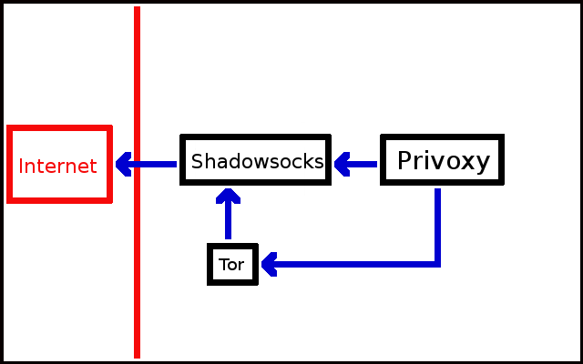

Counterforce
============

> I just want to be a person with all the rights that I should own.

## Legend

Counterforce provides 3 way to access Internet:

* Normal Access.
* Shadowsocks Access (for chinese)
* Tor Access (Because tor is blocked in China, so I have to use shadowsocks as a proxy for it)

## How to use
1. Configure the configuration file of shadowsocks (`storage/shadowsocks/config/config.json`)
2. Install [fig](http://www.fig.sh/)
3. `fig up -d`
4. Use `localhost:8118` as your proxy.
