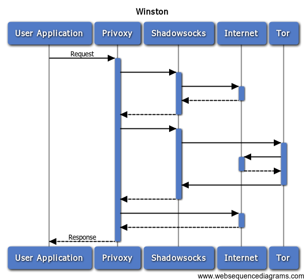

Winston
=======
> What is Winston?

> Winston is the leading role of the book called '1984'.

## Legend

Winston provides 3 ways to access Internet:

* Normal Access.
* Shadowsocks Access.
* Tor Access (Because tor is blocked in China, so it is necessary to use shadowsocks as proxy for it).

## How to use
### Step 1: Set up your Shadowsocks Server
* If you are read english, please read [Shadowsocks Tutorial](https://github.com/shadowsocks/shadowsocks/blob/master/README.md)
* If you can read chinese, please read [Shadowsocks 使用说明](https://github.com/shadowsocks/shadowsocks/wiki/Shadowsocks-%E4%BD%BF%E7%94%A8%E8%AF%B4%E6%98%8E)

### Step 2: Clone Winston

    git clone https://github.com/docker-parasites/winston.git

### Step 3: Set up config/shadowsocks/config.json

`config/shadowsocks/config.json` is the key to connect Shadowsocks Server that you set up in Step 1.

    # Enter Winston
    cd Winston
    # Create 'config/shadowsocks/config.json' according to 'config/shadowsocks/config.json.example'
    nano config/shadowsocks/config.json

### Step 4: Use docker-compose to run Winston
Install docker-compose according to [this article about docker-compose](https://docs.docker.com/compose/).

    docker-compose up -d

After you run this command sucessfully, you will find localhost:8118 is exposed on you machine(Use `netstat -ntlp` to check it).

### Step 5: Set proxy

For users who want to use Winston in their shell environment:

    export PROXY=http://127.0.0.1:8118/
    export http_proxy=$PROXY
    export HTTP_PROXY=$PROXY
    export https_proxy=$PROXY
    export HTTPS_PROXY=$PROXY
    export rsync_proxy=$PROXY
    export RSYNC_PROXY=$PROXY
    export no_proxy="localhost,127.0.0.1"
    export NO_PROXY=$no_proxy

For users who what to use Winston in their web browser:

    # Just use 127.0.0.1:8118 as the proxy of the web browser

## Last

If you have any problem, please contact me(English or Chinese).

> I just want to be a person with all the rights that I should own, including freedom.
