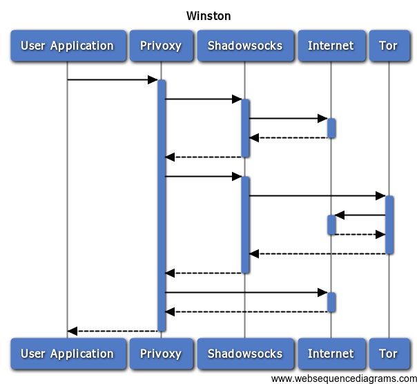

Winston
=======
> What is Winston?

> Winston is the leading role of the book called '1984'.

## Legend

Winston provides 3 ways to access Internet:

* Normal Access.
* Shadowsocks Access.
* Tor Access (Because tor is blocked in China, so it is necessary to use shadowsocks as proxy for it).

## How to use
1. Configure shadowsocks (`config/shadowsocks/config.json`).
2. Install [docker-compose](https://docs.docker.com/compose/).
3. Use dokcer-compose to run Winston.
4. Use localhost:8118 as your proxy.
5. Enjoy it.

## I always said
> I just want to be a person with all the rights that I should own, including freedom.

